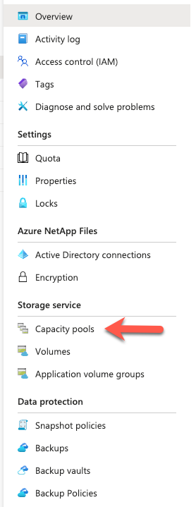
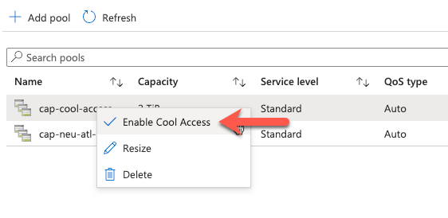

{:.box-note}
## Festive Tech Calendar 2023

{:.box-note}
This blog article is also part of the 2023 [Festive Tech Calendar](https://festivetechcalendar.com/){:target="_blank"}. This year the Festive Tech Calendar Team are raising money for the [@RaspberryPi_org](https://www.raspberrypi.org/donate/){:target="_blank"} Foundation. The team believe its important to support charities who do great work. This year they hope to raise £5000 for this awesome charity! If you would like to donate please visit their [Just Giving Page](https://www.justgiving.com/page/festive-tech-calendar-2023){:target="_blank"}

## Introduction

Recently Microsoft announced the availability of **Cool-Access tier** for Azure NetApp Files (Public Preview).

Azure NetApp Files is a Microsoft first-party file storage service that provides enterprise-grade functionality to customers. It offers three service levels: Ultra, Premium, and Standard. However, it also offers a cool-access tier (Public Preview) that allows customers to save costs while maintaining the same enterprise-grade functionality for their file storage.

The cool-access feature moves cold (infrequently accessed) data transparently to a cheaper storage tier, reducing the cost of Azure NetApp Files storage. The cool-access feature is enabled at the Capacity Pool level and can configured on a volume by volume basis. Customers can specify the number of days (the coolness period, ranging from 7 to 183 days) for inactive data to be considered "cool", the default being 31 days. Once data has reached the specified age, it is then tier to the cool-access layer. The meta data still resides in the volume, so the end users still see their data, but the blocks reside at the cool-access level.

## Considerations

- The cool-access feature is currently in **Public Preview**
- During the preview, cool-access is only available in certain regions. Link here to [Regional availability](https://learn.microsoft.com/en-us/azure/azure-netapp-files/cool-access-introduction#supported-regions){:target="_blank"}
- No guarantee is provided for any maximum latency for client workload for any of the service tiers.
- This feature is available only at the Standard service level. It's not supported for the Ultra or Premium service level.
- Although cool access is available for the Standard service level, how you're billed for using the feature differs from the Standard service level charges.
- You can convert an existing Standard service-level capacity pool into a cool-access capacity pool to create cool access volumes. However, once the capacity pool is enabled for cool access, you can't convert it back to a non-cool-access capacity pool.
- A cool-access capacity pool can contain both volumes with cool access enabled and volumes with cool access disabled.
- After the capacity pool is configured with the option to support cool access volumes, the setting can't be disabled at the capacity pool level. However, you can turn on or turn off the cool access setting at the volume level anytime. Turning off the cool access setting at the volume level stops further tiering of data.
- Standard storage with cool access is supported only on capacity pools of the auto QoS type.
- An auto QoS capacity pool enabled for standard storage with cool access cannot be converted to a capacity pool using manual QoS.
- You can't use large volumes with Standard storage with cool access.
- See Resource limits for Azure NetApp Files for maximum number of volumes supported for cool access per subscription per region.
- If the volume is in a cross-region replication (CRR) relationship as a source volume, you can enable cool access on it only if the mirror state is Mirrored. Enabling cool access on the source volume automatically enables cool access on the destination volume.
- If the volume is in a CRR relationship as a destination volume (data protection volume), enabling cool access on it is not supported.

## Configure Cool-Access

The section below details how to configure Azure NetApp Files cool-access tier.

### Register the Resource Provider

The cool-access tier feature is currently in **Public Preview**, to enable access to the feature you first need to register the resource provider. To register the feature, run the Azure PowerShell command below.

~~~
Register-AzProviderFeature -ProviderNamespace Microsoft.NetApp -FeatureName ANFCoolAccess
~~~

It can take up to one hour for the feature to be registered. To check the feature registration status, run the Azure PowerShell command below.

~~~
Get-AzProviderFeature -ProviderNamespace Microsoft.NetApp -FeatureName ANFCoolAccess
~~~

### Enabling Cool-Access

The cool-access feature is enabled at the capacity pool level. You can enable cool-access on a new or existing capacity pool. It is important to note that the capacity must be set to use Auto QoS.

Create a new capacity pool with cool-access

1. In the Azure portal, browse to the Azure NetApp Files (ANF) blade.
   
2. Choose the ANF account where is wish to create the capacity pool and select capacity pools. 

3. Click **Add pool**, give the pool a name, in Service level select standard and tick the **Enable Cool Access** box. 

4. Click **Create**

This will create a cool-access enabled capacity pool.

**Enable cool-access on an existing capacity pool**
1. In the Azure portal, browse to the ANF blade.
2. Choose the capacity that you wish to enable cool-access and **Right Click**, choose **Enable Cool Access**  

3. Click **Yes**  

Cool-access will now be enable for that capacity pool.

Once you have a capacity enabled for cool-access, you can then create a cool-access enabled volume or enable cool-access on an existing volume.

**Enable Cool-Access on a New Volume**

1. To create a volume with cool-access enabled, in the ANF blade, browse to **Volumes**
2. Click Add volume
3. Complete the Add volume form with the relevant details and tick the **Enable Cool Access** box.  

4. Complete the volume creation page as normal.

**Enable Cool-Access on an Existing Volume**
1. To enable an existing volume with cool-access, in the ANF blade, browse to **Volumes**
   
2. Select to volume you wish to enable for **Cool-Access** and choose **Edit**  

3. Tick the box to **Enable Cool Access**  

4. Click **OK**

You have now enabled cool-access on an existing volume.

## Cool-Access Retrieval Policy

This policy determines the conditions under which data will be transferred back to the hot tier. The settings for this policy can be Default, On-Read, or Never.

Here's a breakdown of the data retrieval behavior based on the cool access retrieval policy settings:

When cool access is enabled:
- If the cool access retrieval policy is not set:
  - The policy defaults to Default, and cold data is moved to the hot tier only when random reads are performed. Sequential reads are served directly from the cool tier.
- If the cool access retrieval policy is set to Default:
  - Cold data is moved by performing random reads only.
- If the cool access retrieval policy is set to On-Read:
  - Cold data is moved by performing both sequential and random reads.
- If the cool access retrieval policy is set to Never:
  - Cold data is served directly from the cool tier and is not moved to the hot tier.

When cool access is disabled:
- The cool access retrieval policy cannot be set if cool access is disabled. If there is existing data in the cool tier from previous tiering when cool access was enabled on the volume, only random reads can be performed to move this data back to the hot tier. In other words, the retrieval policy remains Default on the back end, and no further tiering will occur.

The following restrictions apply to the cool access retrieval policy settings:

- You cannot modify the cool access retrieval policy setting on the volume when the cool access setting is disabled.
- Once you disable the cool access setting on the volume, the cool access retrieval policy setting automatically changes back to Default.

The cool-access retrieval policy can be configured and adjust by editing the volumes settings. See image below.

## Monitoring Cool-Access Tier

There are some **Azure Metrics** that can be used to monitor volumes that have cool-access enabled. These metrics are:
- Volume cool tier size
- Volume cool tier data read size
- Volume cool tier data write size

Within the Azure NetApp Files Volume blade you can select **Metrics**, then choose the date/time range and the metric you wish to view. From here, you can then pin that metric to an **Azure Dashboard**.

The image below shows an example of the Azure Metrics for an ANF volumes cool tier size.

## Summary

The Azure NetApp Files cool-access tier is an excellent way for customers to save costs while maintaining enterprise-grade functionality for their file storage. By enabling standard volumes with cool access, customers can transparently store data more cost-effectively on Azure based on its access pattern, resulting in overall cost savings.
