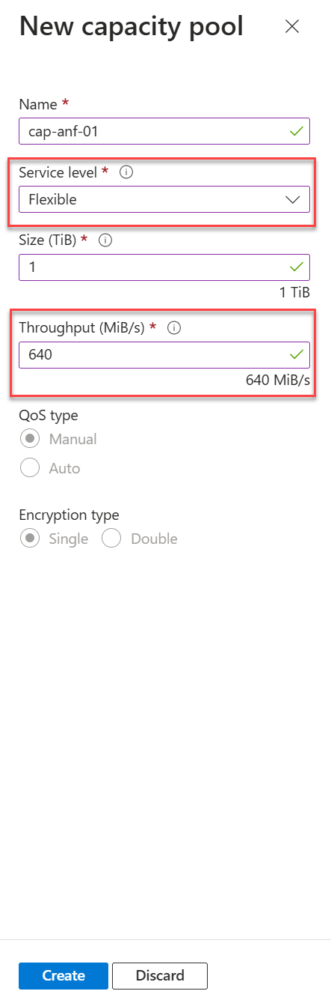

## Flexible Service Level (Public Preview): A New Era in Azure NetApp Files

Last week Microsoft introduced Azure NetApp Files **Flexible service level**—an innovative approach to storage designed to meet the diverse needs of demanding applications such as **HPC**, **Oracle**, **SQL**, **SAP**, **AVD** and **AVS**. With the Flexible service level, you gain the ability to adjust **throughput** and **size limits** independently, giving you unparalleled flexibility for your workloads. Let’s explore the key features and benefits of this preview offering.

---

## **Tailored Storage for Unique Needs**

The Flexible service level empowers you to:

- Create **high-capacity volumes with low throughput requirements**
- Design **low-capacity volumes with high throughput demands**

This adaptability makes it an ideal choice for a wide range of applications, providing performance and efficiency tailored to your specific requirements.

---

## **Throughput: Baseline and Beyond**

Here's how throughput works in a Flexible capacity pool:

- **Baseline Throughput:** The first **128 MiB/second** of throughput is included in the service level. This applies regardless of the pool quota.
- **Maximum Throughput:** The maximum throughput is calculated as **5 x 128 x the size of the capacity pool (in TiB)**. For detailed calculations and examples, see the official documentation.

This flexibility allows you to allocate resources efficiently while ensuring optimal performance for your workloads.

---

## **Key Considerations**

While the Flexible service level offers immense benefits, there are some points to note:

- **Cool Access Limitation:** Cool access is currently **not supported** with the Flexible service level.
- **Exclusive for New Manual QoS Capacity Pools:** This service level is only supported for **new manual QoS capacity pools**. Existing pools cannot leverage this offering.

For more details, including the list of regions where the Flexible service level is available, refer to the [Azure NetApp Files documentation](https://learn.microsoft.com/azure/azure-netapp-files/create-capacity-pool).

---

## **Flexibility Meets Simplicity**

The process of assigning **throughput and capacity** to volumes in a Flexible capacity pool is as straightforward as it is for volumes in manual QoS capacity pools of other service levels. This seamless integration ensures you can adopt the Flexible service level with minimal disruptions to your workflow.

---

## Creating a Flexible Service Level Capacity Pool

1. In the Azuew Portal, brwose for Azure NetApp Files
2. In the lefhand menu choose **Capacity Pools**
3. Select **Add Pool**
4. Name your capacity pool
5. Under **Service Level** choose **Flexible**
6. In the **size** option, add the amount for store you require
7. Under throughput, add the mount of **throughput** you require
8. Click **Create**

The image below shows an example of a **Flexible Service Level** capacity being created. In this example, the size is **1 TiB** and has **640 MiB/s** of throughput allocated.

---

## Summary

Azure NetApp Files continues to push boundaries with the Flexible service level, delivering unmatched adaptability and performance for even the most demanding applications.

This update underscores Azure NetApp Files' commitment to providing innovative and user-centric solutions. By enabling no-downtime upgrades for network features, Microsoft empowers businesses to achieve greater agility and resilience in their cloud operations. Ready to embrace the future of flexible storage?

For more information on the Azure NetApp Files service, check out the [What's new in Azure NetApp Files](https://learn.microsoft.com/en-us/azure/azure-netapp-files/whats-new){:target="_blank"} page.

For more information, visit the official [Azure NetApp Files](https://azure.microsoft.com/en-us/services/netapp/) page.

---

Let me know if you'd like help refining this or adding more details!