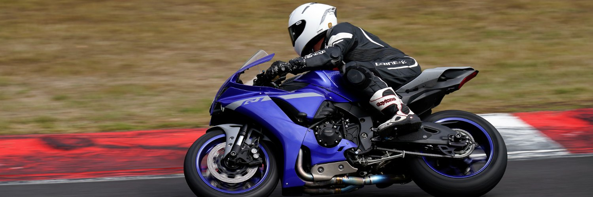

My name is Anthony Mashford, I am a Cloud Solutions Architect working for NetApp and a Microsoft MVP for Azure. I specialise in working with customers to help them understand the Microsoft Azure cloud and how it can transform the way their business functions and help drive innovation.

I have more than two decades of experience working across various verticals including public sector. From start-up companies through to large enterprises, I have helped design, implement and support a wide range of environments.

My career started as a field engineer, before moving onto the help desk, then second and third line support for Data Center operations and customer platforms. After that I progressed to infrastructure architecture and design, more recently specialising in technical pre-sales. For the past twelve years I have been working for Microsoft  Partners within the Microsoft Partner Network. During that time I have gained a wealth of experience & knowledge in varying infrastructures and topologies. Since 2012 I have been focused on cloud, specifically the Microsoft Azure Cloud platform, I really enjoy helping my clients envision and plan their journey to the cloud.

The Microsoft Azure platform brings global hyper-scale compute to the masses, with its OPEX based, pay for what you use model, it allows organisations to develop and build solutions that previously they simply would not have been able to achieve without the flexibility and scale of cloud computing.

I have a real passion for cloud computing and how it is democratising the world of IT, allowing everyone to achieve huge compute power that until recently was only available to large corporations with enterprise scale environments and very deep pockets!  I work with organsiations to help them transform and grow their business using Azure and to understand where they can take advantage of its flexibility and scale.

### In my spare time

Outside of work I enjoy riding my motorcycle, both on the road and on track. I enjoy watching motorcycle racing and I am fascinated by the technology used within the sport, both mechanical and digital and how that affects our everyday road bikes in their performance and safety. I am a member of the Institute of Advanced Motorists and a qualified Advanced Rider. Motorcycling is something I have loved since I was a child, its a hobby that has brought me great joy over the years both as a spectator and as a rider, most important of all, motorcycling is how I met my wife. Living in the digital world, as I do, a chance to get out and ride my motorcycle gives me the time to escape the digital and experience the physical thrill of speed in the real world. This is a great time to reflect on things and gain new perspectives, I love it!
